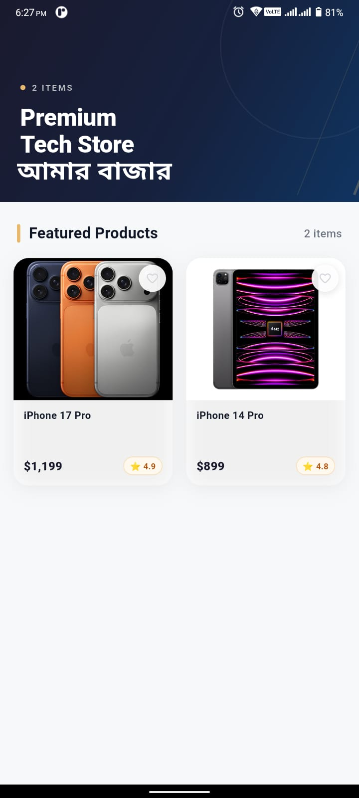

<div align="center">

<br/>

# Amar Bazaar
### Product Catalog — Flutter Assignment

*A production-grade Flutter application that fetches products from a REST API and renders them in a clean, modern catalog experience.*

<br/>


<br/>

> **bdapps National Android Development Bootcamp 2026**  
> Flutter Assignment · Single-Screen Product Catalog

</div>

---

## Screenshot

<div align="center">

</div>

---

## Overview

**Amar Bazaar** is a single-screen Flutter application built for the *bdapps National Android Development Bootcamp 2026*. It fetches a live product list from a REST API and presents it in a polished two-column grid with proper loading, error, and empty states.

The project intentionally applies **Feature-Based Clean Architecture** — the same structural pattern used in production Flutter codebases — to demonstrate that good engineering habits apply even to small assignments.

---

## Features

| Feature               | Details                                                    |
|-----------------------|------------------------------------------------------------|
| Live API Integration  | Products fetched from `api.pixora.one` on every launch     |
| Shimmer Loading State | 6-card skeleton grid while the request is in-flight        |
| Error State + Retry   | Friendly error UI with a single retry button               |
| Empty State           | Handled gracefully with a refresh option                   |
| Pull-to-Refresh       | Swipe down on the grid to reload from the API              |
| Cached Network Images | `cached_network_image` with fade-in and error fallback     |
| Favourite Toggle      | Per-card heart icon (stateful UI, no persistence required) |
| Star Rating Badge     | Visual `⭐ 4.9` badge on every card                         |
| USD Price Formatting  | `intl` package — renders `$1,199` not `1199.0`             |
| Material 3 Design     | Rounded cards, soft shadows, premium spacing               |

---

## Architecture

The project follows a **Feature-Based Clean Architecture**. Each layer has a single responsibility and no cross-layer imports.

```
lib/
│
├── core/
│   ├── constants/
│   │   └── app_colors.dart          ← single color palette, no magic hex values
│   ├── network/
│   │   └── api_client.dart          ← HTTP wrapper, timeout, typed ApiException
│   └── utils/
│       └── currency_formatter.dart  ← intl-based USD formatter
│
├── features/
│   └── products/
│       ├── data/
│       │   ├── models/
│       │   │   └── product_model.dart     ← immutable model, fromJson factory
│       │   └── services/
│       │       └── product_service.dart   ← API call + JSON parsing, zero UI
│       │
│       ├── providers/
│       │   └── product_provider.dart      ← ChangeNotifier, ProductStatus enum
│       │
│       └── presentation/
│           ├── screens/
│           │   └── product_catalog_screen.dart   ← single screen
│           └── widgets/
│               ├── hero_header.dart              ← collapsible SliverAppBar hero
│               ├── product_card.dart             ← card with image, rating, fav
│               ├── product_grid.dart             ← sliver switching all 4 states
│               └── shimmer_product_card.dart     ← skeleton placeholder
│
├── app.dart       ← MaterialApp + ChangeNotifierProvider root
└── main.dart      ← entry point, system UI overlay
```

**Data flow:**  
`ProductCatalogScreen` → reads `ProductProvider` → calls `ProductService` → calls `ApiClient` → parses into `ProductModel` → notifies UI.

---

## State Management

Provider is used via a `ProductStatus` enum with four exhaustive states:

```dart
enum ProductStatus { initial, loading, success, error }
```

This prevents impossible UI states (e.g. `isLoading && hasError` being `true` simultaneously). `ProductGrid` is a single `Consumer` that switches on this enum — no nested conditionals.

---

## API

**Endpoint:** `https://api.pixora.one/products.php`

**Sample response:**
```json
{
  "success": true,
  "data": [
    { "id": 1, "name": "iPhone 17 Pro", "price": 1199, "rating": 4.9, "image": "..." }
  ]
}
```

The `ApiClient` handles:
- 15-second timeout
- HTTP status code validation
- `SocketException` → no internet message
- `FormatException` → malformed data message
- API-level `success: false` → uses the API's own error message

---

## Dependencies

```yaml
provider: ^6.1.2          # state management
http: ^1.2.1              # API requests
cached_network_image: ^3.3.1   # image caching + fade-in
shimmer: ^3.0.0           # loading skeleton effect
intl: ^0.19.0             # price formatting
```

No unnecessary packages. Every dependency earns its place.

---

## Getting Started

**Prerequisites:** Flutter SDK 3.0+ · Android Studio or VS Code · Emulator or physical device

```bash
# Clone the repository
git clone https://github.com/yourusername/amar_bazaar.git
cd amar_bazaar

# Install dependencies
flutter pub get

# Run the app
flutter run

# Build release APK
flutter build apk --release
```

---

## Color Palette

| Role             | Color                                                               | Hex       |
|------------------|---------------------------------------------------------------------|-----------|
| Background       |  Light Grey | `#F7F8FA` |
| Primary / AppBar |  Deep Navy  | `#1A1A2E` |
| Secondary        |  Dark Blue  | `#16213E` |
| Accent           |  Gold       | `#E8B86D` |
| Text Primary     |  Near Black | `#111827` |
| Text Secondary   |  Muted Grey | `#6B7280` |

---

## Assignment Info

| Field            | Details                                           |
|------------------|---------------------------------------------------|
| Program          | bdapps National Android Development Bootcamp 2026 |
| Assignment       | Flutter — Product Catalog Application             |
| Screen Count     | 1 (single screen, by requirement)                 |
| Architecture     | Feature-Based Clean Architecture                  |
| State Management | Provider (`ChangeNotifier`)                       |
| Design System    | Material 3                                        |
| Data Source      | Live REST API                                     |

---

<div align="center">

**Md Shahajalal Mahmud**  
Android Developer · Flutter Learner

*bdapps National Android Development Bootcamp 2026*

</div>